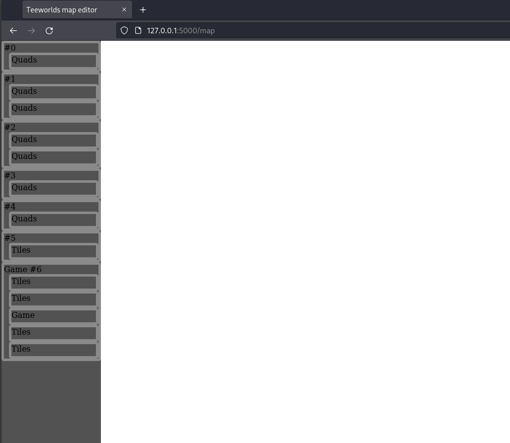
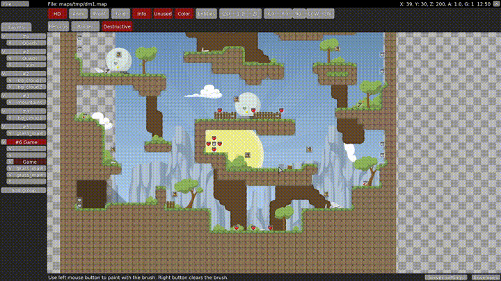

# teeworlds web map editor

This project is in very early development! And its not sure yet if it will ever be usuable!

### setup

    python -m pip install -r requirements.txt

### run development server

    FLASK_ENV=development FLASK_APP=main.py flask run

Then goto http://localhost:5000/map in your browser

